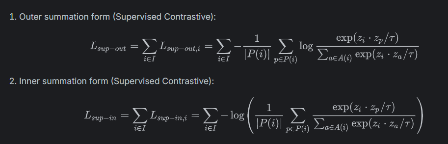

# Supervised Contrastive Learning for Image Classification

This project implements a supervised contrastive learning framework to enhance image classification performance by structuring the feature space more effectively than traditional softmax-based methods.

## 📌 Overview

Traditional classification models optimize only the classification boundary, often overlooking the structure of the embedding space. Supervised contrastive learning (SupCon) incorporates label information during contrastive training, helping the model learn more discriminative and clustered features.

This notebook implements:

- A data augmentation pipeline suitable for contrastive learning.
- A feature extractor (e.g., ResNet) as the backbone encoder.
- Supervised contrastive loss using class-level positive sample selection.
- Projection head and classification head architectures.
- Evaluation of embedding quality and classification accuracy.

## 🧠 Core Concepts

### Supervised Contrastive Loss

The loss functions used in this project are based on supervised contrastive learning theory. The two main formulations are:



Where:
- zᵢ is the anchor embedding  
- P(i) is the set of positives for anchor i  
- A(i) is the set of all other examples in the batch except i  
- τ is the temperature scaling parameter

## 🚀 Features

- Multiple positive handling within the same batch.
- Automatic hard mining behavior through gradient scaling.
- Scalable with increasing batch sizes and negative examples.
- Improves intra-class compactness and inter-class separation in latent space.

## 📁 Files

- `track-1-final-notebook.ipynb`: Main Jupyter Notebook containing implementation, training, and evaluation.

## 🛠️ Setup & Requirements

Ensure you have the following installed:

```bash
pip install tensorflow scikit-learn matplotlib seaborn
```

Or use the notebook in Google Colab for ease of use.

## 📊 Results

- Improved classification performance compared to cross-entropy baseline.
- Strong class-wise clustering in feature space.
- Visualization tools (e.g., t-SNE, PCA) used to assess representation quality.

## 🔍 Future Improvements

- Incorporate momentum encoders (e.g., MoCo-style updates).
- Experiment with temperature tuning and batch composition.
- Fine-tune the backbone with classification head jointly.
